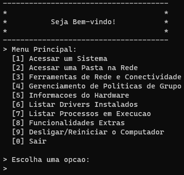

# Lista de Comandos: Windows CMD

> Este programa oferece uma interface de linha de comando para acessar e executar várias operações comuns do sistema, como acessar sites, verificar informações do sistema, pingar em um PC, entre outras. O código utiliza a função system() para executar comandos do sistema operacional.

## 🔧 Tecnologias Utilizadas

No projeto, a principal tecnologia adotada foi a linguagem de programação C.

## 💻 Pré-requisitos

Antes de começar, verifique se você atende aos seguintes requisitos:

- Você tem uma máquina que suporta a execução de programas em C
- Você tem um compilador C instalado (por exemplo, GCC)
- O sistema operacional é Windows

## 🚀 Executando o Projeto

Para compilar e executar o aplicativo, siga estas etapas:

- Abra um terminal e navegue até o diretório onde o arquivo C está localizado
- Compile o código usando o compilador C (por exemplo, `gcc -o comandos .\seu_programa.c`)
- Execute o programa resultante (por exemplo, `.\comcomandos.exe`)

## ☕ Entendendo o Código

O sistema é composto por várias funções que oferecem diferentes funcionalidades:

Cada função é chamada de acordo com a escolha do usuário no menu principal, que é implementado na função menuPrincipal(). O código é estruturado de forma a utilizar condicionais e loops para controlar o fluxo do programa e interagir com o usuário.

## 🤝 Colaboradores

Agradecemos às seguintes pessoas que contribuíram para este projeto:

<table>
  <tr>
    <td align="center">
      <a href="https://github.com/pbgollo" title="Perfil do Pedro Gollo no GitHub">
         
        
          <b>Pedro Gollo</b>
        
      </a>
    </td>
  </tr>
</table>
